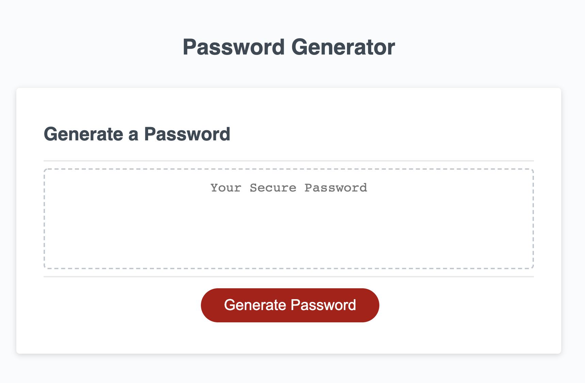

# Random Password Generator

<h2>Description</h2>

* I created a random generated password interface based on user input when prompted. A series of prompts will pop up asking the user for a specified password length, uppercase/lowercase characters, and special characters. Based on what the user inputs, a random password generates inside the box after the prompts are validated. This password can then be copied and used accordingly wherever the user sees fit.

* The password must be between 8-128 characters and the prompt will loop until the user inputs a valid number. 

<h2>Links</h2>

* Check out my deployed Password Generator @ 

